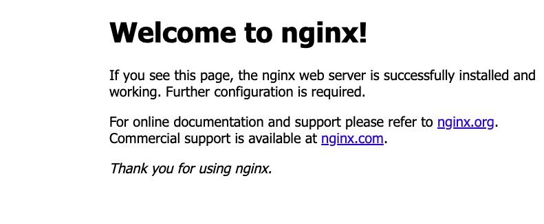

# Docker Installation and Running Nginx/ Jenkins/ MYSQL in a Docker Container onAmazon Linux

1. Login into remote AWS server using the ssh command:

```
ssh ec2-user@ec2-ip-address-dns-name-here

```

2. Apply pending updates using the yum command:

```
sudo yum update

```

3. Search for docker package

```
sudo yum search docker

```

4. Get version information:

```
sudo yum info docker

```

5. install docker, run: 

```
 sudo yum install docker

```

6. Add group membership for the default ec2-user so you can run all docker commands without using the sudo command:

```
sudo usermod -a -G docker ec2-user
id ec2-user
# Reload a Linux user's group assignments to docker w/o logout
newgrp docker

```

7. Docker-compose:

```
# 1. Get pip3 
sudo yum install python3-pip
 
# 2. Then run any one of the following
sudo pip3 install docker-compose # with root access

```

OR

```
wget https://github.com/docker/compose/releases/latest/download/docker-compose-$(uname -s)-$(uname -m) 
sudo mv docker-compose-$(uname -s)-$(uname -m) /usr/local/bin/docker-compose
sudo chmod -v +x /usr/local/bin/docker-compose

```

8. Enable docker service at AMI boot time

```
sudo systemctl enable docker.service

```

9. Start the Docker service

```
sudo systemctl start docker.service

```

Verification
Now that both required software installed, we need to make sure it is working. Hence, type the following commands.

Finding status
Get the docker service status on your AMI instance, run:

```
sudo systemctl status docker.service

```

10. Nginx/Jenkins/MYSQL Installation in docker:
download image nginx

```
docker pull nginx

```

11. Image is made and now we have to make a container using the image with the help of the run command and map it with 80 port number of tcp

```
docker run -d --name [name] -p 80:80 nginx:latest

```

12. Edit inbound rules of your security group in your ec2 instance if required.
Copy your IPv4 address from details section of your ec2 instance and add the particular port number which is mapped with the docker container.

In case of MYSQL, you need to use command "docker run -it --name <name> -e MYSQL_ROOT_PASSWORD=<password> mysql:latest"  to make container using its image.
After this, you need to give "docker exec -it <container id> bash" to enter in bash of the MYSQL container.
Lastly you need to give "mysql -u root -p" to enter username and password to enter MYSQL.

