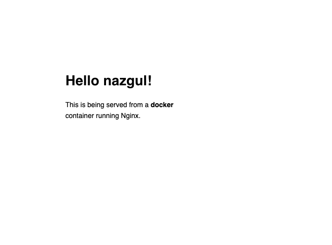

# The image that you are going to use is a single-page website that was already created for this demo and is available on the Docker

Store as dockersamples/static-site. You can download and run the image directly in one go using docker run as follows

```
docker run --name static-site -e AUTHOR="Your Name" -d -P dockersamples/static-site
e61d12292d69556eabe2a44c16cbd54486b2527e2ce4f95438e504afb7b02810

```

This image doesn't run without the -d flag. The -d flag enables detached mode, which detaches the running container from the terminal/shell and returns your prompt after the container starts.
Docker daemon first fetches it from the registry and then runs it as a container.

In the above command

```

-d will create a container with the process detached from our terminal
-P will publish all the exposed container ports to random ports on the Docker host
-e is how you pass environment variables to the container
--name allows you to specify a container name
AUTHOR is the environment variable name and Your Name is the value that you can pass

```

Now can see the ports by running:

```
docker port static-site
```

```
80/tcp -> 0.0.0.0:32769
80/tcp -> [::]:32769
443/tcp -> 0.0.0.0:32768
443/tcp -> [::]:32768
```

Can check by pasting in web browser:

```
ipAddress:32769

```

