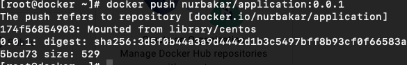
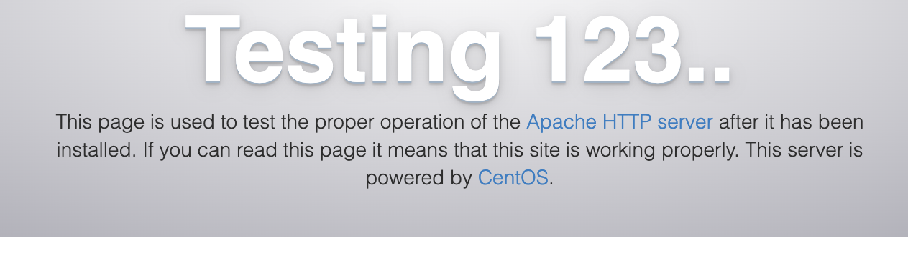

# Project with Wordpress

1; Create droplet in Digital Ocean -> Centos 7 -> New York region -> Basic CPU -> Regular type SSD -> Create 1 droplet

Connect to the VM:

```
ssh root@ip
```

2; Install Docker for CentOS:

```
sudo yum remove docker \
                  docker-client \
                  docker-client-latest \
                  docker-common \
                  docker-latest \
                  docker-latest-logrotate \
                  docker-logrotate \
                  docker-engine

sudo yum install -y yum-utils
sudo yum-config-manager \
    --add-repo \
    https://download.docker.com/linux/centos/docker-ce.repo

sudo yum install docker-ce docker-ce-cli containerd.io docker-buildx-plugin docker-compose-plugin

sudo systemctl start docker
```

3; Create Dockerfile (name always starts from capital letter)

```
vi Dockerfile
# FROM where, what kind of base image we will be using, base image on top of what will be build
FROM centos:7
```

4; Build dockerfile

```
docker build -t nurbakar/application: 0.0.1 .
```

5; Login to Docker:

```
docker login
# Provide name and password
docker push nurbakar/application: 0.0.1
```



Add commands for Docker file

```
FROM centos:7
# Install GIT using RUN command
RUN yum install git -y
```

It can install second layer 2/2, each images has layers.

If we pushing to my repo in Docker:

```
docker push nurbakar/application:0.0.2
```

It is gonna be pushing my second layer, because first layer is already exists.

```
#Giving label of our Layer
LABEL version="0.0.3"
```

Where can give me the following outputs with docker images:

```
REPOSITORY             TAG       IMAGE ID       CREATED         SIZE
nurbakar/application   0.0.2     19eb3b7d3b62   6 minutes ago   461MB
nurbakar/application   0.0.3     622000bc0c0a   6 minutes ago   461MB
nurbakar/application   0.0.1     ba0adccef15b   18 months ago   204MB
```

Adding Maintainer

```
FROM centos:7
RUN yum install git -y && yum install wget -y
LABEL version="0.0.3"
MAINTAINER owner=nazgul
```

One directory only have one Dockerfile.
Can have as many RUNS, as we want.

6; Install wget

```
FROM centos:7
RUN yum install git -y
LABEL version="0.0.3"
MAINTAINER owner=nazgul
RUN yum install wget -y
```

After installing the wget, my layers are increasing the size:

```
REPOSITORY        TAG       IMAGE ID       CREATED          SIZE           
nurbakar/application   0.0.5     22a8f10a1524   6 seconds ago    637MB
nurbakar/application   0.0.2     19eb3b7d3b62   13 minutes ago   461MB
nurbakar/application   0.0.3     622000bc0c0a   13 minutes ago   461MB
nurbakar/application   0.0.4     9beaba84eda8   13 minutes ago   461MB
nurbakar/application   0.0.1     ba0adccef15b   18 months ago    204MB
```

Each additional layer makes our image bigger, make sure to reduce the number of layers, when we reduce the number of layers, image would way less

So for purpose of reducing layers we have to edit the Dockerfile:

```
FROM centos:7
RUN yum install git -y && yum install wget -y
LABEL version="0.0.3"
MAINTAINER owner=nazgul
```

How do make sure you have a small image size, we need to reduce number of layers, put several commands in one line, because each layer add up additional size.

Add environment variables

```
FROM centos:7
RUN yum install git -y && yum install wget -y 
LABEL version="0.0.3"
MAINTAINER owner=nazgul
ENV NAME=alex \
    AGE=21 \
    OCCUPATION=student 
```

Here backslash is only continuation of the command. Adding env variables, doesn't add additional size to my image.

For testing if git or wget has been installed:

```
docker run nurbakar/application:0.0.7 git 
```

8; Install vim editor to my image

```
FROM centos:7
RUN yum install git -y && yum install wget -y && yum install vim -y
LABEL version="0.0.3"
MAINTAINER owner=nazgul
ENV NAME=alex \
    AGE=21 \
    OCCUPATION=student 
```

After installing, if run docker images, I would see:

```
REPOSITORY        TAG       IMAGE ID       CREATED          SIZE           
nurbakar/application   0.0.8     ef6f5cdfd1b0   12 seconds ago   480MB
nurbakar/application   0.0.6     437e44795f7c   23 minutes ago   461MB
nurbakar/application   0.0.7     ce472caf5912   23 minutes ago   461MB
```

It's only added 19 mb, because I put all my commands in one line, I making my app as small as possible.

9; Create simple file and cp to docker image

```
FROM centos:7
RUN yum install git -y && yum install wget -y && yum install vim -y
LABEL version="0.0.3"
MAINTAINER owner=nazgul
ENV NAME=alex \
    AGE=21 \
    OCCUPATION=student 
COPY file /tmp
```

```
docker build -t nurbakar/application:0.0.9 . 
```

Test if my file is copied to /tmp

```
[root@docker ~]# docker run nurbakar/application:0.0.9 cat /tmp/file
# Output
hello
```

Why COPY can be use, when working in company developers can write the code, you can have the Python app, NodeJS, React, you have to copy the code to the container itself, your container won't be running without the code.

For next purpose I've created the couple of files and folders, my goal is to copy everything on my directory to the /tmp :

```
FROM centos:7
RUN yum install git -y && yum install wget -y && yum install vim -y
LABEL version="0.0.3"
MAINTAINER owner=adilet
ENV NAME=alex \
    AGE=21 \
    OCCUPATION=student 
COPY . /tmp
```

COPY . - means copy everything from my directory

```
docker build -t nurbakar/application:0.0.10 .
docker images
nurbakar/application   0.0.10    a2e9425c2036   43 seconds ago      480MB
nurbakar/application   0.0.9     aa5239f269cc   9 minutes ago       480MB
```

```
docker run nurbakar/application:0.0.10 ls /tmp
# It gave this output:
Dockerfile
file
file1
file2
ks-script-DrRL8A
naza
test
yum.log
```

10; Use ADD command in Dockerfile:

```
FROM centos:7
RUN yum install git -y && yum install wget -y && yum install vim -y
LABEL version="0.0.3"
MAINTAINER owner=adilet
ENV NAME=alex \
    AGE=21 \
    OCCUPATION=student 
COPY . /tmp
ADD https://wordpress.org/latest.zip /tmp

```

ADD almost the same as copy, ADD allows us to download from internet zip files, like wget. Download it will move it to /tmp folder, without location it will fail.

```
docker build -t nurbakar/application:0.0.11 .
docker images
nurbakar/application   0.0.11    e88ac2816e7a   6 seconds ago       504MB
nurbakar/application   0.0.10    a2e9425c2036   20 minutes ago      480MB
# Test if the latest.zip is downloaded
docker run nurbakar/application:0.0.11 ls /tmp
Dockerfile
file
file1
file2
ks-script-DrRL8A
latest.zip
naza
test
yum.log
```

11;  Using EXPOSE command, what port this app is listen to, this one is web app =, telling to listen the 80 port.
CMD - command should be run when container is created, CMD can only one in Dockerfile, can be put as the last.

```
FROM centos:
RUN yum install httpd -y && yum install git -y && yum install wget -y && yum install vim -y
LABEL version="0.0.3"
MAINTAINER owner=adilet
ENV NAME=alex \
    AGE=21 \
    OCCUPATION=student
COPY . /tmp
ADD https://wordpress.org/latest.zip /tmp
EXPOSE 80
CMD ["/usr/sbin/httpd","-D","FOREGROUND"]
```

/usr/sbin/httpd" - basically meaning systemctl start httpd, goes to this location and start the daemon.

```

docker build -t nurbakar/application:0.0.13 .
docker images

nurbakar/application   0.0.13    57e29956b7e0   28 seconds ago      537MB
nurbakar/application   0.0.12    7860873eacec   3 minutes ago       504MB
```

Let's detach the container

```
docker run -d --name web-app -p 80:80 nurbakar/application:0.0.13
docker ps
#Should have the app running, that successfully running the Apache server
```



11; let's create the application simple
Create index.html with simple web app content copy index.html

```
FROM centos:7
RUN yum install httpd -y && yum install git -y && yum install wget -y && yum install vim -y
LABEL version="0.0.3"
MAINTAINER owner=adilet
ENV NAME=alex \
    AGE=21 \
    OCCUPATION=student
COPY . /tmp
COPY index.html /var/www/html/
ADD <https://wordpress.org/latest.zip> /tmp
EXPOSE 80
CMD ["/usr/sbin/httpd","-D","FOREGROUND"]

```

```

docker build -t nurbakar/application:0.0.14 .
[root@docker ~]# docker images
REPOSITORY             TAG       IMAGE ID       CREATED             SIZE
nurbakar/application   0.0.14    b681abf91329   16 seconds ago      537MB
nurbakar/application   0.0.13    57e29956b7e0   24 minutes ago      537MB
docker ps
docker ps
CONTAINER ID   IMAGE                         COMMAND                  CREATED          STATUS          PORTS                               NAMES
c794d9011aa2   nurbakar/application:0.0.13   "/usr/sbin/httpd -D …"   23 minutes ago   Up 23 minutes   0.0.0.0:80->80/tcp, :::80->80/tcp   web-app

```

Now I have the running container, i have to remove the all running containers, not conflict containers.

```

docker rm -f c794d9011aa2

# For forcefully deleting all containers, running and exited containers


docker container prune --force
```

```

docker build -t nurbakar/application:0.0.16 .
docker run -d --name web -p 80:80 nurbakar/application:0.0.16

```


