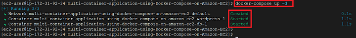

# How to Deploy multiple application Containers using Docker Compose On Amazon EC2

Docker Compose:
docker Compose is a tool that was developed to help define and share multi container applications. With Compose we can create the YAML file to define the services with a single command we can spin everything up and can tears down.

Docker Compose is used for running multiple containers as a single service. Each of containers here runs in isolation but can interact with each other when required.

If you have an application that requires NGINX server and REdis database, can create Docker Compose File that can run both containers as a service without the need to start each one separately.

```
Step 1: Setting up EC2 Instance:
We will first create an AWS Instance (Amazon Linux) free tier eligible using the AWS console.

Step 2: Installing Docker and Docker Compose:
Apply pending updates using the yum command:
sudo yum update

Search for the Docker package:
sudo yum search docker 

Get version information:
sudo yum info docker

install Docker:
sudo yum install docker

Add group membership for the default ec2-user so you can run all docker commands without using the sudo command:
sudo usermod -a -G docker ec2-user

Enable docker service at AMI boot time
sudo systemctl enable docker. service

Start the Docker service:
sudo systemctl start docker. service

To verify the docker service status on your AMI instance, run
sudo systemctl status docker. service

To download and install Compose standalone, run:
sudo curl -SL https://github.com/docker/compose/releases/download/v2.17.2/docker-compose-linux-x86_64 -o /usr/local/bin/docker-compose

Apply executable permissions to the standalone binary in the target path for the installation.
sudo chmod +x /usr/local/bin/docker-compose

git clone https://github.com/NazgulM/dockerProjects.git

cd multiple_containers_dc_
```

Once in the project directory, start the containers using compose.yaml file and the following command:
docker-compose up -d


To confirm that both WordPress and db containers are running, run $ docker ps and you should see an output similar to the image below.


We can also confirm the availability of two separate volumes by running the $ docker volume ls command as shown below:


Testing your deployment
The application we just deployed talks on port 8081 as mentioned in our compose.yaml file but if you visit port 8081 with the public address of your EC2 instance, you won’t be able to view it. This is because of the security group settings which currently only allow inbound traffic from SSH, HTTP, and HTTPS:

So to access our application from our browser, go to the EC2 instance console, with your EC2 instance selected, move to the Security tab, and then click on the security group as in the image below.


With that done, when you visit your_instance_public_ip:8081 you should see the WordPress Installation page as in the image below.


we will demonstrate that if we destroy both of our containers the data will live on past the lifecycle of these containers.

Let’s go to our EC2 machine terminal and issue the below command:

docker-compose down

```
[+] Running 3/3
 ✔ Container multiple_containers_dc_-db-1         Removed                                                                                                       0.0s 
 ✔ Container multiple_containers_dc_-wordpress-1  Removed                                                                                                       0.0s 
 ✔ Network multiple_containers_dc__default        Removed 

 docker ps
CONTAINER ID   IMAGE     COMMAND   CREATED   STATUS    PORTS     NAMES

docker volume ls
DRIVER    VOLUME NAME
local     multiple_containers_dc__mariadb_data
local     multiple_containers_dc__wordpress_data

 ```

Now if we create two new containers and set them to use these named volumes then the containers will use the data contained in these volumes which contains the WordPress Post created earlier. Let’s test with the docker-compose up -d command which will utilize the images which we have stored locally, in addition, it will utilize the existing name volumes and won’t create new ones.




